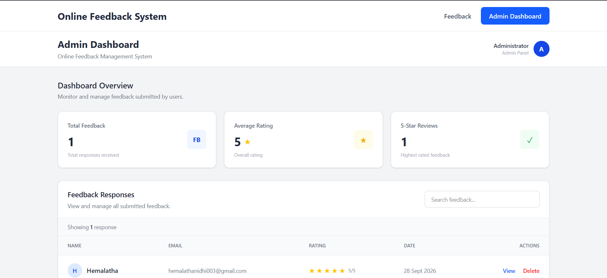
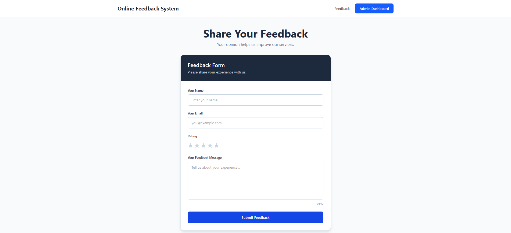

# Online Feedback System

A full-stack web application for collecting, managing, and reviewing user feedback.

## Project Overview

The Online Feedback System allows users to submit feedback through a simple web form. An administrator can securely access the dashboard to view feedback, check ratings, search responses, and delete feedback.

## Features

### User

- Submit name
- Submit email
- Give a rating from 1 to 5 stars
- Enter feedback message
- Receive submission confirmation

### Admin

- Admin login
- View total feedback
- View average rating
- View number of 5-star reviews
- Search feedback
- View complete feedback details
- Delete feedback
- View submission date

## Technologies Used

### Frontend

- React.js
- Vite
- Tailwind CSS
- Axios
- React Router

### Backend

- Node.js
- Express.js
- MongoDB
- Mongoose
- CORS
- dotenv

## Project Structure

```text
Online-Feedback-System
│
├── Backend
│   ├── .env
│   ├── .gitignore
│   ├── db.model.js
│   ├── index.js
│   ├── package.json
│   └── package-lock.json
│
├── Frontend
│   ├── src
│   │   ├── components
│   │   │   ├── Dashboard.jsx
│   │   │   ├── Form.jsx
│   │   │   └── Report.jsx
│   │   ├── App.jsx
│   │   ├── index.css
│   │   └── main.jsx
│   ├── package.json
│   └── package-lock.json
│
└── README.md


## Project Screenshots

### Feedback Form



### Admin Dashboard

